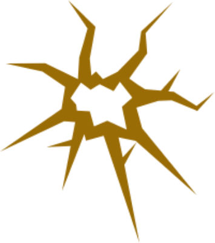

# KraK - Build Tools for Computational Analyses

[](https://travis-ci.co/yetisir/krak) [](https://coveralls.io/github/yetisir/krak?branch=master) [](https://codeclimate.com/github/yetisir/krak/maintainability) [](https://krak.readthedocs.io/en/latest/?badge=latest)
  

KraK is a Python library to help build and run computational geomechnical models. 

## Installation

The latest stable release of KraK can be installed with [pip](https://pip.pypa.io/en/stable/).
 
```bash
python -m pip install krak
```

## Documentation

The latest documentation is hosted [here](https://krak.readthedocs.io/en/latest/?badge=latest)


## License
dNote is licensed under the  [GNU GPLv3](https://choosealicense.com/licenses/gpl-3.0/)

